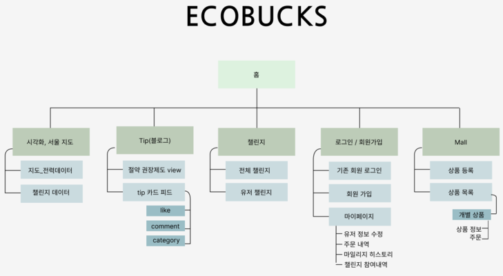
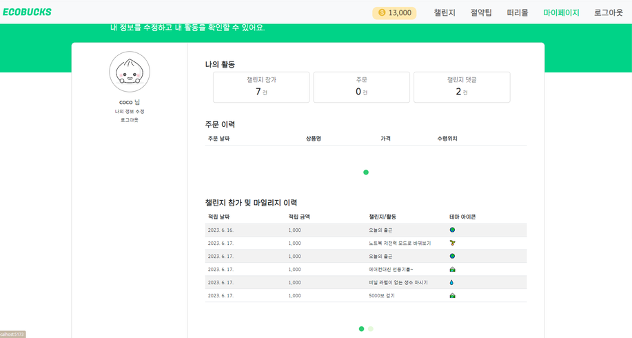
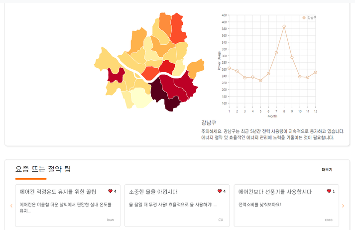
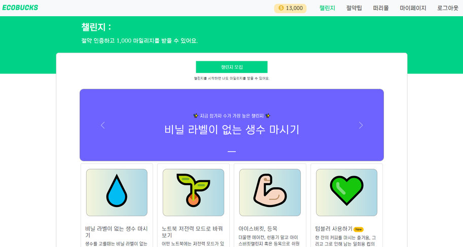
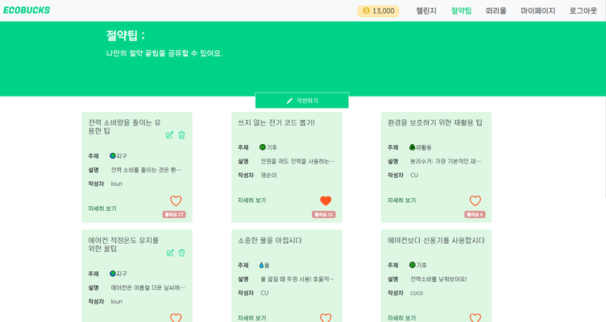
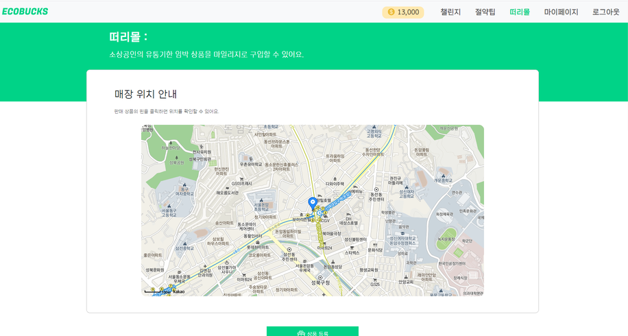

# 에코벅스

- 서비스명: 에코벅스
- 팀명: 벨루가
- 주제: 전기 소비량이 지구에 어떤 영향을 미칠까
- 목표: 전력데이터를 이용해 매 해 여름마다 블랙아웃이나 전력 피크타임, 전력계통 신뢰도에 대한 문제를 제기하고, 이런 전력 사용문제를 일반인에게 보기좋게 전달하고, 더 나아가 전력량 절감을 권장하기.

# 기술 스택

## Languages and Tools

<p align="left"> <a href="https://developer.mozilla.org/en-US/docs/Web/JavaScript" target="_blank" rel="noreferrer"> </a>
<a href="https://www.w3.org/html/" target="_blank" rel="noreferrer"> </a> <a href="https://www.w3schools.com/css/" target="_blank" rel="noreferrer"> </a> </p>

- JavaScript
- HTML
- CSS

## FrontEnd

<a href="https://reactjs.org/" target="_blank" rel="noreferrer">  </a>

- Vite(React.js)
- Axios
- Chart.js

## BackEnd

<a href="https://expressjs.com" target="_blank" rel="noreferrer"> </a> <a href="https://nodejs.org" target="_blank" rel="noreferrer"> </a>

- JavaScript
- Node.js
- express.js

## DataBase

<a href="https://www.mongodb.com/" target="_blank" rel="noreferrer"> </a>

- MongoDB

## Data Analysis

<p align="left">  <a href="https://www.python.org" target="_blank" rel="noreferrer">  </a>    <a href="https://pandas.pydata.org/" target="_blank" rel="noreferrer"> </a> </p>

- Numpy
- Pandas
- Geopandas
- Matplotlib

# 에코벅스란?

- 환경을 보호하고 지속 가능한 에너지 소비를 촉진하기 위해 전력소비량에 대한 데이터를 분석하고 인사이트를 도출하는 웹 서비스를 제공합니다.
- 이 웹 서비스는 사용자들이 전력소비량을 줄이거나 절약하는 데 도움을 주고자 합니다.

## 2. 프로젝트 기능 설명

1. 데이터 분석 및 시각화
   - 전력 소비량 데이터를 분석하여 다양한 그래프와 시각화 도구를 활용해 사용자에게 제공합니다.
   - 이를 통해 사용자는 자신의 전력 사용 패턴과 비교하여 에너지 소비에 대한 인사이트를 얻을 수 있습니다.
2. 에너지 절약 팁

   - 전력 소비량을 줄이기 위한 실용적인 팁과 권장 사항을 제공합니다.
   - 예를 들어, 에너지 효율적인 가전제품의 선택, 조명 및 전자기기의 사용 방법 등을 안내합니다.

3. 마일리지 시스템

   - 사용자가 전력 소비를 줄이거나 절약하는 등의 지속 가능한 에너지 관행을 채택하면, 해당 사용자에게 마일리지를 제공합니다.
   - 마일리지는 사용자가 쇼핑몰에서 물건을 구매할 때 할인 혹은 특별 혜택으로 사용 될 수 있습니다.

4. 음식몰 쓰레기를 줄이는 마감 임박 떠리몰
   - 편의점, 빵집, 마트 등 유통기한이 임박해 폐기가 다가오는 제품을 저렴하게 구매할 수 있는 떠리몰을 운영합니다.
   - 판매자는 폐기가 줄어 좋고, 소비자는 저렴하게 제품을 구해 서로에게 윈윈이 되는 환경 보호 떠리몰.

## 3. 프로젝트 구성도



## 4. 웹 서비스 페이지 구성 소개

1. Main page
   

2. Home page
   

3. Challenge page
   

4. Bloging page
   

5. shopping mall
   
   

> .

## 5. 프로젝트 팀원 역할 분담

| 이름   | 담당 업무               |
| ------ | ----------------------- |
| 정원석 | 팀장/프론트엔드 개발    |
| 정소현 | 프론트엔드 개발         |
| 이은석 | 백엔드 개발/데이터 분석 |
| 이승현 | 백엔드 개발/데이터 분석 |
| 이로운 | 백엔드 개발/데이터 분석 |

## 폴더 트리

```
📦새 폴더
 ┣ 📂back
 ┃ ┣ 📂src
 ┃ ┃ ┣ 📂controllers
 ┃ ┃ ┃ ┣ 📜blogcomment-controller.js
 ┃ ┃ ┃ ┣ 📜blogpost-controller.js
 ┃ ┃ ┃ ┣ 📜challenge-comment-controller.js
 ┃ ┃ ┃ ┣ 📜challenge-controller.js
 ┃ ┃ ┃ ┣ 📜challenge-participation-controller.js
 ┃ ┃ ┃ ┣ 📜data-controller.js
 ┃ ┃ ┃ ┣ 📜image-controller.js
 ┃ ┃ ┃ ┣ 📜order-controller.js
 ┃ ┃ ┃ ┣ 📜product-controller.js
 ┃ ┃ ┃ ┗ 📜user-controller.js
 ┃ ┃ ┣ 📂db
 ┃ ┃ ┃ ┣ 📂models
 ┃ ┃ ┃ ┃ ┣ 📜BlogComment.js
 ┃ ┃ ┃ ┃ ┣ 📜BlogPost.js
 ┃ ┃ ┃ ┃ ┣ 📜challenge-comment.js
 ┃ ┃ ┃ ┃ ┣ 📜challenge-participation.js
 ┃ ┃ ┃ ┃ ┣ 📜Challenge.js
 ┃ ┃ ┃ ┃ ┣ 📜district.js
 ┃ ┃ ┃ ┃ ┣ 📜image.js
 ┃ ┃ ┃ ┃ ┣ 📜order.js
 ┃ ┃ ┃ ┃ ┣ 📜Product.js
 ┃ ┃ ┃ ┃ ┗ 📜User.js
 ┃ ┃ ┃ ┣ 📂schemas
 ┃ ┃ ┃ ┃ ┣ 📜blogComment.js
 ┃ ┃ ┃ ┃ ┣ 📜blogPost.js
 ┃ ┃ ┃ ┃ ┣ 📜challenge-comment.js
 ┃ ┃ ┃ ┃ ┣ 📜challenge-participation.js
 ┃ ┃ ┃ ┃ ┣ 📜challenge.js
 ┃ ┃ ┃ ┃ ┣ 📜district.js
 ┃ ┃ ┃ ┃ ┣ 📜districtUsage.js
 ┃ ┃ ┃ ┃ ┣ 📜image.js
 ┃ ┃ ┃ ┃ ┣ 📜order.js
 ┃ ┃ ┃ ┃ ┣ 📜product.js
 ┃ ┃ ┃ ┃ ┣ 📜seasonalUsage.js
 ┃ ┃ ┃ ┃ ┣ 📜seoulUsage.js
 ┃ ┃ ┃ ┃ ┗ 📜user.js
 ┃ ┃ ┃ ┗ 📜index.js
 ┃ ┃ ┣ 📂middlewares
 ┃ ┃ ┃ ┣ 📜error-middleware.js
 ┃ ┃ ┃ ┣ 📜login-required.js
 ┃ ┃ ┃ ┗ 📜validation.js
 ┃ ┃ ┣ 📂routers
 ┃ ┃ ┃ ┣ 📜blogcomment-router.js
 ┃ ┃ ┃ ┣ 📜blogpost-router.js
 ┃ ┃ ┃ ┣ 📜challenge-comment-router.js
 ┃ ┃ ┃ ┣ 📜challenge-participation-router.js
 ┃ ┃ ┃ ┣ 📜challenge-router.js
 ┃ ┃ ┃ ┣ 📜data-router.js
 ┃ ┃ ┃ ┣ 📜image-router.js
 ┃ ┃ ┃ ┣ 📜order-router.js
 ┃ ┃ ┃ ┣ 📜product-router.js
 ┃ ┃ ┃ ┗ 📜user-router.js
 ┃ ┃ ┣ 📂services
 ┃ ┃ ┃ ┣ 📜blogcomment-service.js
 ┃ ┃ ┃ ┣ 📜blogpost-service.js
 ┃ ┃ ┃ ┣ 📜challenge-comment-service.js
 ┃ ┃ ┃ ┣ 📜challenge-participation-service.js
 ┃ ┃ ┃ ┣ 📜challenge-service.js
 ┃ ┃ ┃ ┣ 📜data-service.js
 ┃ ┃ ┃ ┣ 📜image-local-save-service.js
 ┃ ┃ ┃ ┣ 📜image-service.js
 ┃ ┃ ┃ ┣ 📜order-service.js
 ┃ ┃ ┃ ┣ 📜product-service.js
 ┃ ┃ ┃ ┗ 📜user-service.js
 ┃ ┃ ┣ 📂utils
 ┃ ┃ ┃ ┣ 📜constants.js
 ┃ ┃ ┃ ┣ 📜cron-schedule.js
 ┃ ┃ ┃ ┣ 📜customError.js
 ┃ ┃ ┃ ┣ 📜update-time.js
 ┃ ┃ ┃ ┗ 📜validators.js
 ┃ ┃ ┗ 📜app.js
 ┃ ┣ 📂uploads
 ┃ ┣ 📜.babelrc
 ┃ ┣ 📜.gitignore
 ┃ ┣ 📜index.js
 ┃ ┣ 📜package-lock.json
 ┃ ┣ 📜package.json
 ┃ ┣ 📜yarn-error.log
 ┃ ┗ 📜yarn.lock
 ┣ 📂data
 ┃ ┣ 📂seoul_map
 ┃ ┃ ┣ 📜district1.png
 ┃ ┃ ┣ 📜district2.png
 ┃ ┃ ┣ 📜district3.png
 ┃ ┃ ┣ 📜district4.png
 ┃ ┃ ┣ 📜district5.png
 ┃ ┃ ┣ 📜LARD_ADM_SECT_SGG_11.dbf
 ┃ ┃ ┣ 📜LARD_ADM_SECT_SGG_11.prj
 ┃ ┃ ┣ 📜LARD_ADM_SECT_SGG_11.shp
 ┃ ┃ ┣ 📜LARD_ADM_SECT_SGG_11.shx
 ┃ ┃ ┗ 📜seoulMap.png
 ┃ ┣ 📜DataAnalysis_1_overall.ipynb
 ┃ ┣ 📜DataAnalysis_2_District.ipynb
 ┃ ┣ 📜DataAnalysis_3_Season.ipynb
 ┃ ┣ 📜DomesticAverage.png
 ┃ ┣ 📜DomesticDistrict.png
 ┃ ┗ 📜Industry.png
 ┣ 📂front
 ┃ ┣ 📂public
 ┃ ┃ ┗ 📜vite.svg
 ┃ ┣ 📂src
 ┃ ┃ ┣ 📂assets
 ┃ ┃ ┃ ┣ 📜alert.jsx
 ┃ ┃ ┃ ┣ 📜banner1.png
 ┃ ┃ ┃ ┣ 📜banner2.png
 ┃ ┃ ┃ ┣ 📜banner3.png
 ┃ ┃ ┃ ┣ 📜blogIcon.png
 ┃ ┃ ┃ ┣ 📜challenge.png
 ┃ ┃ ┃ ┣ 📜challengeIcon.png
 ┃ ┃ ┃ ┣ 📜districtInfo.jsx
 ┃ ┃ ┃ ┣ 📜ecologo.png
 ┃ ┃ ┃ ┣ 📜favicon-32x32.png
 ┃ ┃ ┃ ┣ 📜font.css
 ┃ ┃ ┃ ┣ 📜heartblank.png
 ┃ ┃ ┃ ┣ 📜heartfill.png
 ┃ ┃ ┃ ┣ 📜logo.png
 ┃ ┃ ┃ ┣ 📜mall.png
 ┃ ┃ ┃ ┣ 📜mallIcon.png
 ┃ ┃ ┃ ┣ 📜placeholder.png
 ┃ ┃ ┃ ┣ 📜react.svg
 ┃ ┃ ┃ ┗ 📜tip.png
 ┃ ┃ ┣ 📂context
 ┃ ┃ ┃ ┗ 📂user
 ┃ ┃ ┃ ┃ ┗ 📜UserProvider.jsx
 ┃ ┃ ┣ 📂pages
 ┃ ┃ ┃ ┣ 📂Blog
 ┃ ┃ ┃ ┃ ┣ 📜Blog.jsx
 ┃ ┃ ┃ ┃ ┣ 📜BlogComment.jsx
 ┃ ┃ ┃ ┃ ┣ 📜BlogLike.jsx
 ┃ ┃ ┃ ┃ ┣ 📜BlogPost.jsx
 ┃ ┃ ┃ ┃ ┣ 📜BlogPostEdit.jsx
 ┃ ┃ ┃ ┃ ┗ 📜BlogRead.jsx
 ┃ ┃ ┃ ┣ 📂Challenge
 ┃ ┃ ┃ ┃ ┣ 📜ChallengeComments.jsx
 ┃ ┃ ┃ ┃ ┣ 📜ChallengeCreate.jsx
 ┃ ┃ ┃ ┃ ┣ 📜ChallengePage.jsx
 ┃ ┃ ┃ ┃ ┣ 📜ChallengeParticipate.jsx
 ┃ ┃ ┃ ┃ ┣ 📜ChallengeRead.jsx
 ┃ ┃ ┃ ┃ ┣ 📜ChallengeUpdate.jsx
 ┃ ┃ ┃ ┃ ┣ 📜ChallengeView.jsx
 ┃ ┃ ┃ ┃ ┗ 📜MegaChallengeCarousel.jsx
 ┃ ┃ ┃ ┣ 📂HomePage
 ┃ ┃ ┃ ┃ ┣ 📂Data
 ┃ ┃ ┃ ┃ ┃ ┣ 📜DistrictChart.jsx
 ┃ ┃ ┃ ┃ ┃ ┣ 📜SeoulDistrictGraph.jsx
 ┃ ┃ ┃ ┃ ┃ ┗ 📜SeoulUsageGraph.jsx
 ┃ ┃ ┃ ┃ ┣ 📂svg
 ┃ ┃ ┃ ┃ ┃ ┗ 📜seoulDistricts.jsx
 ┃ ┃ ┃ ┃ ┣ 📜BannerCarousel.jsx
 ┃ ┃ ┃ ┃ ┣ 📜HomePage.jsx
 ┃ ┃ ┃ ┃ ┣ 📜Intro.jsx
 ┃ ┃ ┃ ┃ ┣ 📜TrendingBlogs.css
 ┃ ┃ ┃ ┃ ┣ 📜TrendingBlogs.jsx
 ┃ ┃ ┃ ┃ ┣ 📜TrendingChallenges.css
 ┃ ┃ ┃ ┃ ┗ 📜TrendingChallenges.jsx
 ┃ ┃ ┃ ┣ 📂Layout
 ┃ ┃ ┃ ┃ ┣ 📜Header.jsx
 ┃ ┃ ┃ ┃ ┣ 📜Layout.jsx
 ┃ ┃ ┃ ┃ ┣ 📜LeftNav.jsx
 ┃ ┃ ┃ ┃ ┗ 📜RightNav.jsx
 ┃ ┃ ┃ ┣ 📂Login
 ┃ ┃ ┃ ┃ ┗ 📜Login.jsx
 ┃ ┃ ┃ ┣ 📂Mall
 ┃ ┃ ┃ ┃ ┣ 📜Mall.jsx
 ┃ ┃ ┃ ┃ ┣ 📜MallProductEdit.jsx
 ┃ ┃ ┃ ┃ ┣ 📜MallProductSell.jsx
 ┃ ┃ ┃ ┃ ┗ 📜MapContainer.jsx
 ┃ ┃ ┃ ┣ 📂Modal
 ┃ ┃ ┃ ┃ ┣ 📜BlogModal.jsx
 ┃ ┃ ┃ ┃ ┗ 📜PaginationBar.jsx
 ┃ ┃ ┃ ┣ 📂My
 ┃ ┃ ┃ ┃ ┣ 📜MyPage.jsx
 ┃ ┃ ┃ ┃ ┣ 📜UserEditForm.jsx
 ┃ ┃ ┃ ┃ ┣ 📜UserMileageHistory.jsx
 ┃ ┃ ┃ ┃ ┣ 📜UserOrderHistory.jsx
 ┃ ┃ ┃ ┃ ┗ 📜UserSummary.jsx
 ┃ ┃ ┃ ┗ 📂Register
 ┃ ┃ ┃ ┃ ┗ 📜Register.jsx
 ┃ ┃ ┣ 📂reducer
 ┃ ┃ ┃ ┣ 📜action.jsx
 ┃ ┃ ┃ ┗ 📜reducer.jsx
 ┃ ┃ ┣ 📂routes
 ┃ ┃ ┃ ┣ 📜Router.jsx
 ┃ ┃ ┃ ┗ 📜routes.jsx
 ┃ ┃ ┣ 📂util
 ┃ ┃ ┃ ┗ 📜common.js
 ┃ ┃ ┣ 📜api.jsx
 ┃ ┃ ┣ 📜App.css
 ┃ ┃ ┣ 📜App.jsx
 ┃ ┃ ┣ 📜index.css
 ┃ ┃ ┗ 📜main.jsx
 ┃ ┣ 📜.eslintrc.cjs
 ┃ ┣ 📜index.html
 ┃ ┣ 📜package-lock.json
 ┃ ┣ 📜package.json
 ┃ ┣ 📜vite.config.js
 ┃ ┗ 📜yarn.lock
 ┣ 📜.gitignore
 ┣ 📜.prettierrc
 ┗ 📜README.md
```
